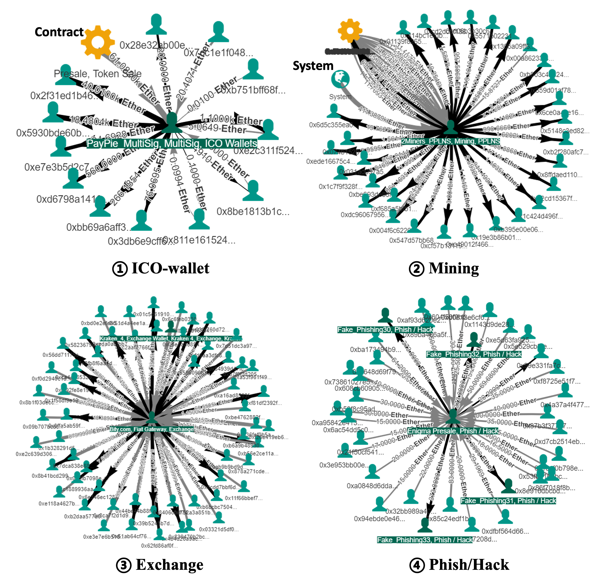
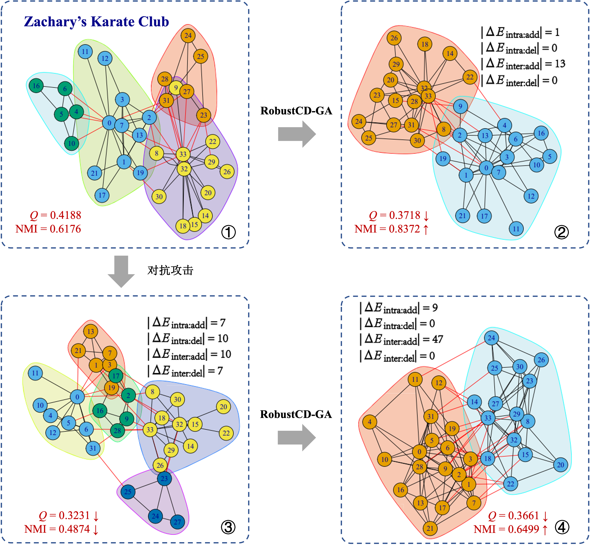
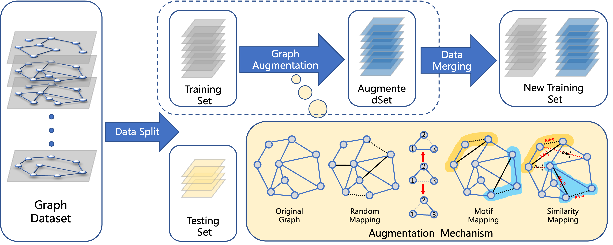

---

## 💁🏻‍♂️ About Me

> *I am currently a Postdoctoral Research Fellow with the Institute of Cyberspace Security, Zhejiang University of Technology. I obtained my Ph.D. degree from Zhejiang University of Technology in 2023 under the supervision of Prof. Qi Xuan.*

✉️ **Email:**  [jjzhou@zjut.edu.cn](https://exmail.qq.com/)

🔗 **More:**  [[Google Scholar]](https://scholar.google.com.hk/citations?user=IeL03fYAAAAJ&hl=en), [[Github]](https://github.com/jjzhou012)

---

## ⭐ Research Interests

  - Graph Data Mining
  - Graph Machine Learning
  - Graph Analysis for Blockchain Transaction
  - Graph Analysis for Cybersecurity

  
## 📚 Selected Recent Works

      <article class="item">
        

          <!-- image -->
          
        

        

        <!-- <header><a href="/jekyll-TeXt-theme/page/single.html"><h2 itemprop="headline" class="item__header">Page - Single</h2></a></header> -->
          

            <!-- description -->
          

  - **Behavior-aware Account De-anonymization on Ethereum Interaction Graph**
  - *IEEE Transactions on Information Forensics and Security (IEEE TIFS 2022, CCF A, SCI Q1)*
  - **Jiajun Zhou**, Chenkai Hu, Jianlei Chi, Jiajing Wu, Meng Shen, Qi Xuan*.
  - [[Paper](https://arxiv.org/abs/2203.09360)] [[Code](https://github.com/jjzhou012/Ethident)]

</article>
<!--  -->
<!--  -->
      <article class="item">
        

          <!-- image -->
          
        

        

        <!-- <header><a href="/jekyll-TeXt-theme/page/single.html"><h2 itemprop="headline" class="item__header">Page - Single</h2></a></header> -->
          

            <!-- description -->
          

  - **RobustECD: Enhancement of Network Structure for Robust Community Detection**
  - *IEEE Transactions on Knowledge and Data Engineering (IEEE TKDE 2021, CCF A, SCI Q2)*
  - **Jiajun Zhou**, Zhi Chen, Min Du, Lihong Chen, Shanqing Yu, Guanrong Chen, Qi Xuan**.*
  - [[Paper](https://ieeexplore.ieee.org/document/9454336)] [[Code](https://github.com/jjzhou012/RobustECD)]

</article>
<!--  -->
<!--  -->
      <article class="item">
        

          <!-- image -->
          
        

        

        <!-- <header><a href="/jekyll-TeXt-theme/page/single.html"><h2 itemprop="headline" class="item__header">Page - Single</h2></a></header> -->
          

            <!-- description -->
          

  - **Data Augmentation for Graph Classification**
  - *ACM International Conference on Information and Knowledge Management (CIKM 2020, CCF B)*
  - **Jiajun Zhou**, Jie Shen, Qi Xuan*.
  - [[Paper](https://dl.acm.org/doi/10.1145/3340531.3412086)]

</article> 
<!--  -->
      <article class="item">
        

          <!-- image -->
          
        

        

        <!-- <header><a href="/jekyll-TeXt-theme/page/single.html"><h2 itemprop="headline" class="item__header">Page - Single</h2></a></header> -->
          

            <!-- description -->
          

  - **M-Evolve: Structural-Mapping-Based Data Augmentation for Graph Classification**
  - *IEEE Transactions on Network Science and Engineering (IEEE TNSE 2020, SCI Q1)*
  - **Jiajun Zhou**, Jie Shen, Shanqing Yu, Guanrong Chen, Qi Xuan*.
  - [[Paper](https://ieeexplore.ieee.org/abstract/document/9237158)]

</article> 

---

- **Heterogeneous Feature Augmentation for Ponzi Detection in Ethereum**
  - *IEEE Transactions on Circuits and Systems II: Express Briefs (IEEE TCAS2 2022, SCI-II)*
  - Chengxiang Jin, Jie Jin, **Jiajun Zhou***, Jiajing Wu, Qi Xuan. **(Corresponding Author)**
  - [[Paper](https://ieeexplore.ieee.org/abstract/document/9781627/)] [[Code](https://github.com/jjzhou012/HFAug)]
- **Cross Cryptocurrency Relationship Mining for Bitcoin Price Prediction**
  - *2022 International Conference on Blockchain and Trustworthy Systems (BlockSys 2022, EI)*
  - Panpan Li, Shengbo Gong, Shaocong Xu, **Jiajun Zhou***, Yu Shanqing, Qi Xuan. **(Corresponding Author)**
  - [[Paper](https://scholar.google.com.hk/citations?view_op=view_citation&hl=en&user=IeL03fYAAAAJ&citation_for_view=IeL03fYAAAAJ:ZeXyd9-uunAC)]
- **Phishing Fraud Detection on Ethereum using Graph Neural Network**
  - *2022 International Conference on Blockchain and Trustworthy Systems (BlockSys 2022, EI)*
  - Panpan Li, Yunyi Xie, Xinyao Xu, **Jiajun Zhou***, Qi Xuan. **(Corresponding Author)**
  - [[Paper](https://arxiv.org/abs/2204.08194)]
- **Identity Inference on Blockchain using Graph Neural Network**
  - *2021 International Conference on Blockchain and Trustworthy Systems (BlockSys 2021, EI)*
  - Jie Shen, **Jiajun Zhou**, Yunyi Xie, Shanqing Yu, Qi Xuan*.
  - [[Paper](https://link.springer.com/chapter/10.1007/978-981-16-7993-3_1)] [[Code](https://github.com/jjzhou012/I2BGNN)]
- **Dual-channel Early Warning Framework for Ethereum Ponzi Schemes**
  - *The 7th China National Conference on Big Data & Social Computing (BDSC 2022, EI)*
  - Jie Jin, **Jiajun Zhou***, Chengxiang Jin, Shanqing Yu, Ziwan Zheng, Qi Xuan. **(Corresponding Author)**
  - [[Paper](https://arxiv.org/abs/2206.07895)]
- **Hub-collision avoidance and leaf-node options algorithm for fractal dimension and renormalization of complex networks**
  - *Chaos: An Interdisciplinary Journal of Nonlinear Science (Chaos, SCI-II)*
  - FeiYan Guo, **JiaJun Zhou**, ZhongYuan Ruan, Jian Zhang, Lin Qi*
- **Sampling Subgraph Network With Application to Graph Classification**
  - *IEEE Transactions on Network Science and Engineering (IEEE TNSE  2021, SCI-II*
  - Jinhuan Wang, Pengtao Chen, Bin Ma, **Jiajun Zhou**, Zhongyuan Ruan, Guanrong Chen, Qi Xuan**.*
  - [[Paper](https://ieeexplore.ieee.org/abstract/document/9547804/)]
- **Research of Adversarial Attack Method in Face Recognition System**
  - *Journal of Chinese Computer Systems (JCCS 2019)*
  - Jinyin Chen, **Jiajun Zhou**, Shijing Shen, Haibin Zheng, Qi Xuan*.
  - [[Paper](http://xwxt.sict.ac.cn/CN/abstract/abstract5069.shtml)]

## 📚 Publication: Book

- **Subgraph Augmentation with Application to Graph Mining**
  - In **Book Chapter** of *Graph Data Mining: Algorithm, Security and Application (Springer 2021)*
  - **Jiajun Zhou**, Jie Shen, Shanqing Yu , Qi Xuan, Guanrong Chen*. **
  - [[Paper](https://link.springer.com/chapter/10.1007/978-981-16-2609-8_4)]
- **Understanding Ethereum Transactions via Network Approach**
  - In **Book Chapter** of *Graph Data Mining: Algorithm, Security and Application (Springer 2021)*
  - Yunyi Xie, **Jiajun Zhou**, Jinhuan Wang, Jian Zhang, Yunxuan Sheng, Jiajing Wu, Qi Xuan*. **
  - [[Paper](https://link.springer.com/chapter/10.1007/978-981-16-2609-8_7)]
- **Adversarial Attacks on Graphs: How to Hide Your Structural Information**
  - In **Book Chapter** of *Graph Data Mining: Algorithm, Security and Application (Springer 2021)*
  - Yalu Shan, Junhao Zhu, Yunyi Xie, Jinhuan Wang, **Jiajun Zhou**, Bo Zhou, Qi Xuan*.
  - [[Paper](https://link.springer.com/chapter/10.1007/978-981-16-2609-8_5)]

<!-- ## 🧑🏻‍💻 **Employment** Experience

**Dec. 2018 - Nov.2019**

### **The Big Search in Cyberspace Research Center**

- **Zhejiang Lab, Hangzhou 311121, China.**
- *Participate in the building of cyberspace intelligent search system. Explore graph inference in finance knowledge graph.*

## 💼 Others

- **Peer review summary**
  - *ACM Computing Surveys*
  - *IEEE Transactions on Network Science and Engineering* -->
